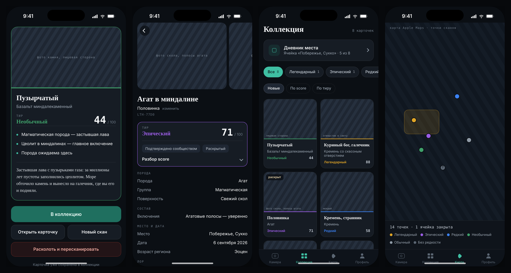

# Lithos

Take a photo of a rock. Lithos identifies it, scores how rare it is for the place you found it, and adds it to your collection as a card.

Status: in development. Works end to end on a real iPhone through Expo Go; the scan worker runs on a VPS. The UI is in Russian for now. Developer notes in Russian: [README.ru.md](README.ru.md).

## Problem
Birders have Merlin and naturalists have iNaturalist. Rock collectors have field guides: identifying a rock from a photo is hard,
and there's no reason to keep looking once the novelty wears off. Lithos turns each find into an identified, scored card tied to a real place.

## What it does
- Photo → rock type with confidence, alternatives and a short origin story
- Score out of 100 from shape, fit with the local geology, composition and inclusions; the score sets the tier
- Suggests splitting a dull rock when the inside is likely to score higher
- Collection with filters by tier and score, plus a diary of what is expected and already found in each area
- Map of published finds, with a consent step before a find's exact location becomes public

## Screenshots / demo


Screens from the clickable design prototype ([docs/design](docs/design)); rock photos are placeholders.

## How it's built
- Expo (React Native) app, Node worker, Supabase (Postgres, Storage, Realtime, pgmq queues)
- Each scan goes through a staged model pipeline: a cheap gate model, a main model, escalation for hard cases, then rules. One result row per stage keeps retries idempotent
- 60-photo golden set (CC-licensed) for evals when swapping models; daily budget and per-user scan limits
- Product spec, AI pipeline spec and development plan live in the repo; each task has a write-up in [docs/tasks](docs/tasks)
- Built with Claude Code, using custom planner, QA, code-review and devops agents and pre-deploy test hooks ([.claude](.claude))

## Run locally
```bash
pnpm install
cp .env.example .env   # Supabase project and model API keys
pnpm db:migrate
pnpm dev               # worker + Expo dev server; scan the QR code with Expo Go
```
